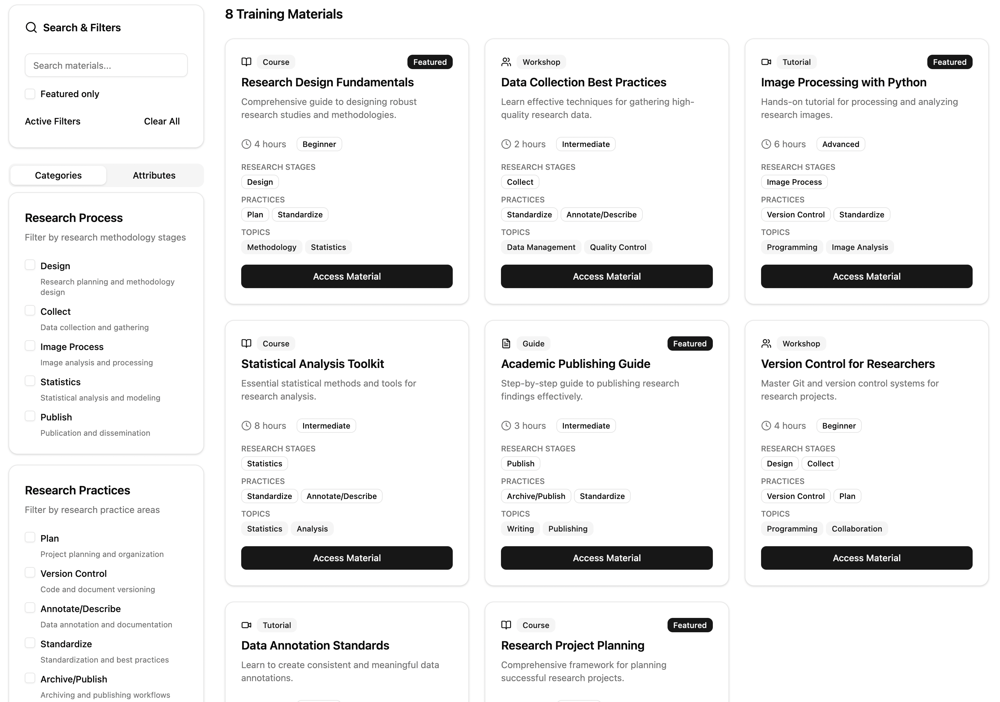

# ReproInventory
A repo for developing the ReproNim inventory of training resources.

# Access the ReproInventory
1. See a collated overview of all training resources [here](table.md). This overview was created from writing the Google Sheet table to markdown using a short Python scipt.

2. An alternative would be [here](https://docs.google.com/spreadsheets/d/e/2PACX-1vSWI7KLG_j9GjDkwQhnZNKMNNZmoKfURbMTWbLdjANqKGizBfH6V_uvW2vfHK2l0ejOXxqxEKLOszEw/pubhtml). This overview was created by exporting the Google Sheets table to HTML.

# Background
**ReproNim** has developed a lot of [training resources](https://www.repronim.org/teach.html). 
The **[INCF-ReproNim Fellows](https://www.repronim.org/fellowship.html)** have developed a lot of [training resources](https://www.repronim.org/fellows-resources) including a [Training Tool-kit](https://drive.google.com/drive/u/0/folders/1_qLgvQAI_71768_45gMBb7n4DpsY7Wil).
The community (neuroimaging and beyond) has developed a lot of training resources. When a user is faced with the 
desire to 'teach' a topic, how do they navigate all this content to find (or adapt, as needed) the right resources 
to start from?

We seek to create a ***ReproNim Inventory of Training Resources*** to help find what's out there so that users can more efficiently 
Identify, reuse, and adapt existing resources instead of always starting from scratch.

## Similar Inventories Efforts
We know of a number of existing resources that have attempted to do parts of this. These include (but are not limited to):
* [ReproRehabDB](https://reprorehabdb.usc.edu/)
* [LearnNeuroimaging/Hitchhacker's guide to the brain](https://learn-neuroimaging.github.io/hitchhackers_guide_brain/)
* [NITRC Training Resource Query](https://www.nitrc.org/search/?type_of_search=group&q=training)
* [BrainHack School Training Modules](https://school-brainhack.github.io/modules/)
* [INCF Training Space](https://training.incf.org/)
* [Neuroimaging Carpentry](https://conp-pcno-training.github.io/neuroimaging-carpentry/)
  * [Software Carpentry](https://www.software-carpentry.org/)
* And many more! (Add your favorites here!)


## Other specific Resources we should make sure are included
Want other specific resources included? Add them here (or file an issue)

# What do we need to do?
* Review ***existing*** inventories
* Expand ***content***
  * For each resource, what do we want to know about it?
    * Identify the training resource 'schema' that we want to use

* Adopt a ***front end*** (how the content is displayed) and associated ***back end*** to store the information
  * What do we really want to see?
     * Search: by topic tag (i.e. git), by format (i.e. hands-on tutorial), by level (i.e. first-timers), by duration (i.e. 3 hour), etc. 
  * Do any of the existing platforms already do this?
     * Which comes closest? 

     
# Our Training Resource Description Model

Our current model (v_0.0.1) is expressed in YAML [here](model/model.yaml). A more human-readable version of that model is [here](model/model.md).


# Project development (OHBM Hackathon)

OHBM 2025 - [project-ohbm-hackathon here](https://github.com/ohbm/hackathon2025/issues/7)

<details> 
<summary>Example Queries</summary>
 
# Example Queries
* I would like to find a 1 hour lecture to introduce git/github to novice first year graduate students in my Introduction to Computational Neuroscience course
* I would like to find 1.5 hr multishell diffusion (dMRI) course video (in lecture style)
* I would like to know whether the course depends on some installation requirements/ pre-requesites (other than skill level)
* I would like to find a course on python that preps my undergraduate students for my neuroimaging with python class
* I would like to find a 1-day workshop on "Introduction to Reproducible Neuroimaging" to provide to my lab of 20 members, who range from RA (data collection, data analysis) to clinical investigators.

* Can I find a hands-on tutorial for BIDS conversion of my DICOM data

### *By Skill Level or Prerequisites*

* “What beginner-level tutorials are available for fMRI analysis?”
* “Are there any advanced courses that require experience with FreeSurfer?”


### *By Software or Tool*

* “Show me all courses that use Python and AFNI.”
* “Are there tutorials that involve SPM and are hands-on?”


### *By Imaging Modality*

* “What training materials cover resting-state fMRI?”
* “Any diffusion MRI (DWI) tutorials using open datasets?”


### *By Format or Delivery*

* “What video-based tutorials are self-paced?”
* “Are there instructor-led courses longer than 1 week?”

### *By Research Application*

* “Do you have any training focused on pediatric neuroimaging?”
* “What resources are relevant for clinical research?”


### *By Language or Accessibility*

* “Are there any Spanish-language courses on structural MRI?”
* “Which tutorials include assessments or quizzes?”

</details>

<details>
<summary>Example Use Stories</summary>

## Example Use Stories

1. **New PhD Student**

“I’m just starting in a neuroimaging lab and I’ve never used FreeSurfer. I want a beginner-friendly, step-by-step guide in English, ideally with video or interactive examples. It should be focused on structural MRI.”

***Query:***
* Level = Beginner
* Software = FreeSurfer
* Format = video OR tutorial
* Modality = Structural
* Language = English

2. **Clinical Neuroscientist Switching to Python**

“I’ve worked in clinical MRI research using SPM and MATLAB. I want to transition to Python and need resources on functional MRI analysis using open datasets.”

***Query:***
* Software = SPM OR Python
* Modality = Functional
* Open dataset = Yes
* Format = Hands-on / tutorial
* Language = English

3. **Instructor Designing a Curriculum**

“I’m building a neuroimaging methods course and want to include diverse materials—lectures, blogs, tutorials—across beginner to advanced levels. I want content I can reuse, so open datasets are a plus.”

***Query:***
Level = Beginner to Advanced
Content format = Any
Open dataset = Yes
Delivery = Instructor

4. **International Learner**

“I’m a French-speaking student interested in learning about fMRI preprocessing using FSL.”

***Query:***
* Language = French
* Software = FSL
* Modality = Functional


</details>

<details>
<summary>Developer Documentation</summary>
 
# Developer Documentation

## Frontend

Example figure from the frontend (on 'dummy' data):


### Build dependencies

- nodejs

  You can install from https://nodejs.org/en/download/

### Local development

- Get the project source code

  ```bash
  git clone https://github.com/ReproNim/ReproInventory.git
  ```

- Install dependencies

```bash
cd frontend
npm install
```

- Now run the app by running

```bash
npm run dev
```

</details>
